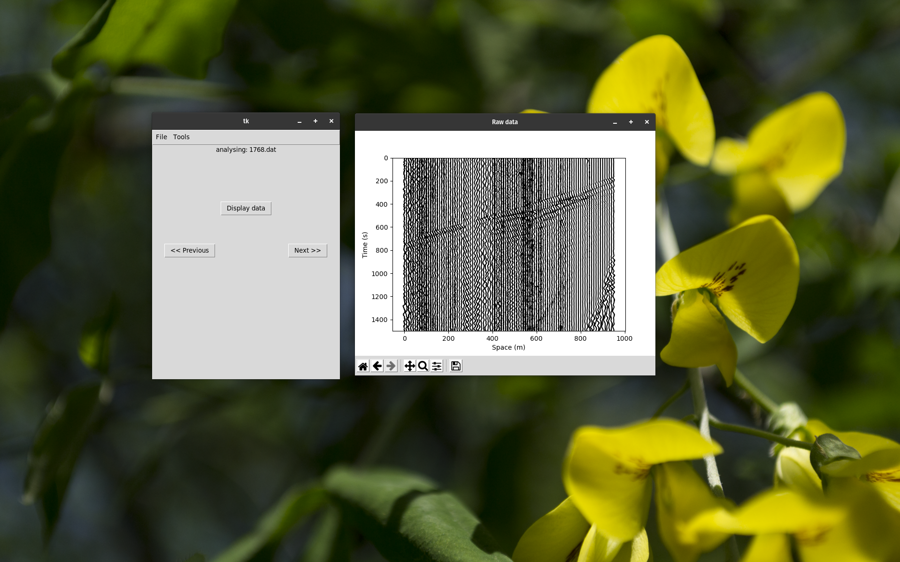

# Pyseismic


Pyseismic is a simple python interface created to visualize and process seismic traces based on the Obspy package (https://docs.obspy.org/). The aim of this project is to create a simple alternative to the more complex and _costly_ Visual SUNT (http://www.wgeosoft.ch/PDF/Visual_SUNT_Pro_Data.html) that can be used to do basic taks without the need to buy professional softwares. Since is entirely written in pyhon it can be run on every platform (Visual SUNT is only on Windows D:).

## Functions

The available functions are:

+ Raw data visualizer



+ FFT analyzer and trace filtering


+ Frist break picking and dromochrome plotting


### FFT analysis

To analyze the frequency spectrum with the FFT algorithm select the desired traces window and select "tools>fft". After that you can choose the area to analyze by dragging across the desired traces by delimiting a rectangle. A window will pop up with the frequency spectrum of the traces inside of the rectangle.

The rectangle area can be moved and resized. 

### First break controls

To pick the first break points first select the traces window and then select "tools>dromo". After that you can pick the points on the graph by cliking the "w" key. The point will snap to the nearest trace to the mouse cursor. To delete the point put the mouse cursor near the point and click the "d" key. 

## Dipendencies

+ Obspy:

```
pip install obspy
```

+ Numpy:

```
pip install numpy
```

+ Scipy:

```
pip install scipy
```

## Todolist

1. Automatic first break
2. Trace muting
3. More precise import options (as for now it relies on the autodetect features of Obspy) 
4. Simple stratigraphic model reconstruction (from dromochrome elaboration)
5. Delaytime and GRM applications
6. SRCS
7. Focal mechanism reconstruction
